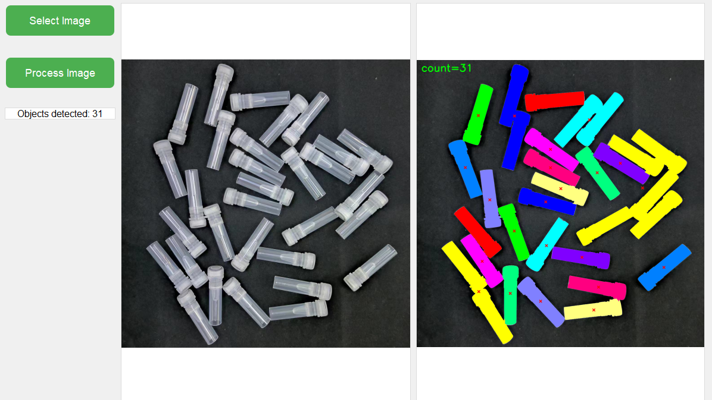
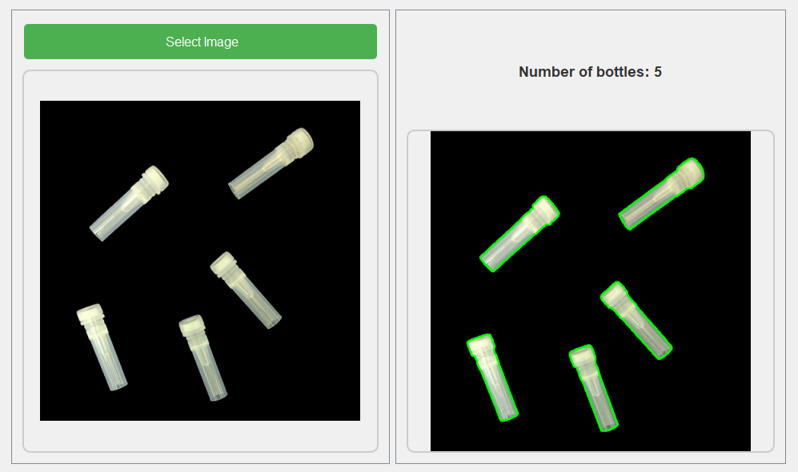

# Adhesion Target Detection Based on Watershed Algorithm(基于分水岭算法的粘连目标检测)

**主要使用了分水岭算法(Watershed Algorithm)进行图像分割。**

(为的是实现小瓶子的计数，一共分成了3个py文件，BottleDetectUI.py是带UI界面的，另外两个会把mask等都显示出来，方便查看，当然也可以根据需要，调整为只显示result)

BottleDetect_MobileSAM.py是利用预训练模型做的，权重等文件下载：https://github.com/ChaoningZhang/MobileSAM ，由于没有微调(对于简单情况够用)，针对粘连情况的效果不好，UI界面见下图。

**基于分水岭算法的代码在项目正式完工前将不会公开，如有需要请联系本人(比如你也是为代码捉急的大学生···)**

用到的方法：

1. 边缘保留滤波 (Edge Preserving Filtering)：
   使用 `cv2.pyrMeanShiftFiltering` 进行去噪，同时保留边缘信息。
2. 二值化 (Binarization)：
   使用 Otsu's 方法 (`cv2.THRESH_OTSU`) 自动确定阈值，将图像转换为二值图像。
3. 距离变换 (Distance Transform)：
   使用 `cv2.distanceTransform` 计算二值图像中每个像素到最近的背景像素的距离。
4. 连通区域标记 (Connected Components Labeling)：
   使用 `cv2.connectedComponents` 标记图像中的连通区域。
5. 形态学操作 (Morphological Operations)：
   使用 `cv2.morphologyEx` 进行膨胀操作，用于确定未知区域。
6. 分水岭算法 (Watershed Algorithm)：
   使用 `cv2.watershed` 进行图像分割。这是程序的核心算法，用于分离粘连的对象。
7. 轮廓检测 (Contour Detection)：
   使用 `cv2.findContours` 检测分割后的每个对象的轮廓。
8. 面积计算 (Area Calculation)：
   使用 `cv2.contourArea` 计算每个轮廓的面积。
9. 图像矩计算 (Image Moments)：
   使用 `cv2.moments` 计算轮廓的矩，用于找到轮廓的中心点。
10. 中值滤波 (Median Filtering)：
    使用 `np.median` 计算面积的中位数，用于设定面积阈值。
11. 图像叠加 (Image Blending)：
    使用 `cv2.addWeighted` 将原图和标记后的图像进行叠加。
12. 图像缩放 (Image Resizing)：
    使用 `cv2.resize` 调整最终结果图像的大小。

## **Reference**

https://cloud.tencent.com/developer/article/1900798
